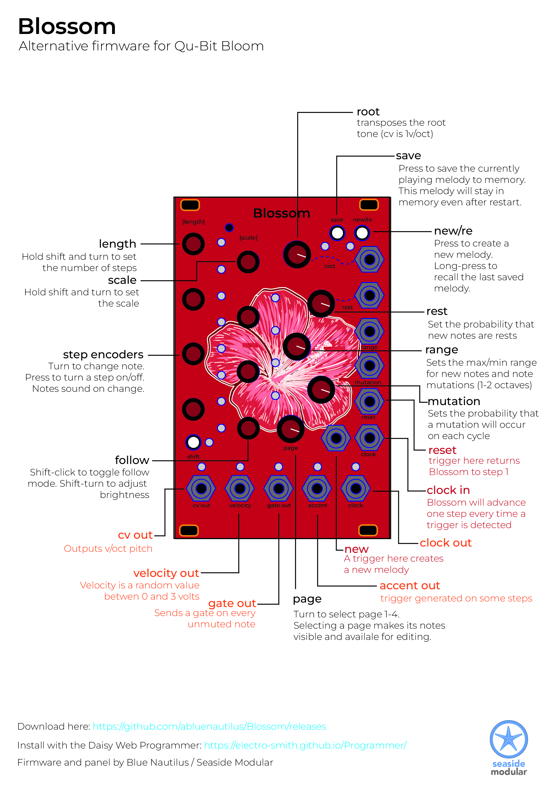

# Blossom alternative firmware for Daisy Bloom

Please see [the Manual](BlossomManual.pdf) for full instructions. 

# Troubleshooting

Most of the time firware flashing issues come down to your cable. But do you need to go back to the official Qu-Bit firwmare? Use the electro-smith Daisy programmer: 

[https://electro-smith.github.io/Programmer/](https://electro-smith.github.io/Programmer/)

